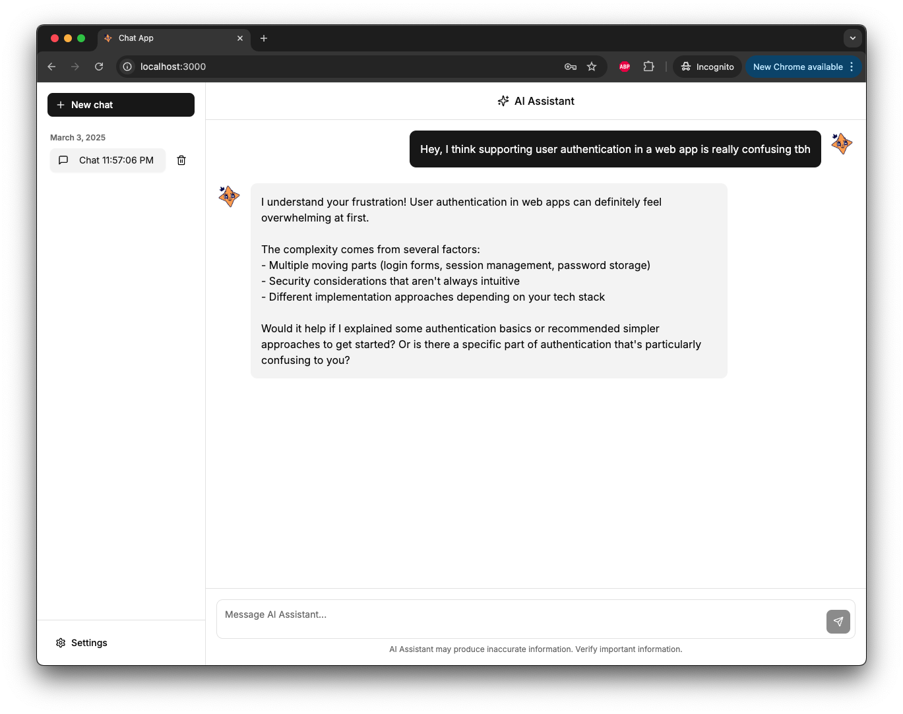

# 🤖 ChatGPT Next.js Application

A modern chat application built with Next.js, integrating Anthropic's AI capabilities and Supabase for data storage.




- [Next.js](https://nextjs.org/) - React framework
- [Anthropic AI SDK](https://www.anthropic.com/) - AI integration
- [Supabase](https://supabase.com/) - Backend and database
- [Tailwind CSS](https://tailwindcss.com/) - Styling
- [TypeScript](https://www.typescriptlang.org/) - Type safety
- [Radix UI](https://www.radix-ui.com/) - UI components

## ✨ Prerequisites

Before you begin, you'll need to set up your development environment. Follow the instructions for your operating system:

### Windows (WSL2)

1. **Install WSL2 (Windows Subsystem for Linux)**

   ```powershell
   # Open PowerShell as Administrator and run:
   wsl --install
   ```

   After installation, restart your computer.

2. **Install Node.js on WSL**

   ```bash
   # Open WSL terminal and run:
   curl -fsSL https://deb.nodesource.com/setup_18.x | sudo -E bash -
   sudo apt-get install -y nodejs
   ```

3. **Install Git on WSL**

   ```bash
   sudo apt-get update
   sudo apt-get install git

   # Configure Git
   git config --global user.name "Your Name"
   git config --global user.email "your.email@example.com"
   ```

4. **Install pnpm**
   ```bash
   curl -fsSL https://get.pnpm.io/install.sh | sh -
   # Restart your terminal or run:
   source ~/.bashrc
   ```

### macOS

1. **Install Homebrew** (if not already installed)

   ```bash
   /bin/bash -c "$(curl -fsSL https://raw.githubusercontent.com/Homebrew/install/HEAD/install.sh)"
   ```

2. **Install Node.js**

   ```bash
   brew install node@18
   ```

3. **Install Git**

   ```bash
   brew install git

   # Configure Git
   git config --global user.name "Your Name"
   git config --global user.email "your.email@example.com"
   ```

4. **Install pnpm**
   ```bash
   brew install pnpm
   ```

### Verify Installation

After installing the above tools, verify your setup:

```bash
node --version     # Should be v18 or higher
pnpm --version     # Should be installed
git --version      # Should be installed
```

### Required Accounts & API Keys

You'll also need:

1. **Supabase Account & Project**

   - Sign up at [Supabase](https://supabase.com)
   - Create a new project
   - Get the `URL` and `anon public` key from Project Settings → Data API

2. **Anthropic API Key**
   - Sign up at [Anthropic Console](https://console.anthropic.com)
   - Navigate to API Keys section
   - Create a new API key
   - **Note:** May require credit card information

## 🚀 Getting Started

1. Clone (or fork) the repository

2. Install dependencies with `pnpm install`

3. Copy the `.env.example` file to a new `.env` file, and fill in the values.

4. Go to your Supabase Dashboard -> SQL Editor, paste the contents of the `setup.sql` file, and click "Run".

5. Go to your terminal and run `pnpm run dev`.

6. Open [http://localhost:3000](http://localhost:3000) with your browser to see the result.

## 📁 Project Structure

```bash
chatgptnextjs/
├── app/                # Next.js app directory
│   ├── api/           # API route handlers
│   │   ├── chat/      # AI chat endpoints
│   │   └── conversations/ # Conversation management
│   ├── auth/          # Authentication pages and callback
│   ├── layout.tsx     # Root layout with auth and theme
│   └── page.tsx       # Main chat interface
├── components/        # React components
│   ├── ui/           # Reusable UI components
│   ├── chat-area.tsx # Main chat interface
│   └── chat-sidebar.tsx # Conversation sidebar
├── lib/              # Shared utilities
│   └── supabase.ts   # Supabase client and types
└── types/            # TypeScript type definitions
```

### 🗺️ Next.js App Router

The project uses Next.js 14 App Router with server-side authentication:

```bash
app/
├── layout.tsx        # Root layout with Supabase auth
├── page.tsx         # Main chat interface
├── auth/           # Authentication routes
│   ├── callback/   # OAuth callback handling
│   │   └── route.ts  # GET /auth/callback
│   └── layout.tsx  # Auth pages layout
└── api/           # API route handlers
    ├── chat/      # AI chat endpoints
    │   └── route.ts  # POST /api/chat - Authenticated AI responses
    └── conversations/  # Conversation management
        ├── route.ts   # GET & POST /api/conversations
        └── [id]/     # Specific conversation routes
            ├── route.ts   # DELETE /api/conversations/[id]
            └── messages/  # Message management
                └── route.ts # GET & POST messages
```

### 📍 API Endpoints

- `GET /auth/callback`

  - Handles OAuth callback from Supabase
  - Exchanges code for session
  - Redirects to home or error page

- `POST /api/chat`

  - Requires authentication
  - Streams AI responses using Claude
  - Accepts chat messages in request body

- `GET /api/conversations`

  - Requires authentication
  - Returns user's conversations with messages
  - Ordered by creation date (newest first)

- `POST /api/conversations`

  - Requires authentication
  - Creates conversation for current user
  - Optionally accepts initial messages

- `DELETE /api/conversations/[id]`

  - Requires authentication
  - Only deletes if user owns conversation
  - Removes conversation and all messages

- `GET /api/conversations/[id]/messages`

  - Requires authentication
  - Only returns if user owns conversation
  - Messages ordered chronologically

- `POST /api/conversations/[id]/messages`
  - Requires authentication
  - Only posts if user owns conversation
  - Creates new message in conversation

### ➕ Adding New Routes

To add new functionality:

1. Create route handler in `app/api/`:

   - Use `route.ts` for HTTP methods
   - Add server-side authentication
   - Include proper error handling

2. Add UI components in `app/`:

   - Create new page or component
   - Use client-side auth hooks if needed
   - Follow existing patterns for data fetching

3. Update types in `types/`:
   - Add new type definitions
   - Update existing types if needed

## 📝 License

This project is licensed under the MIT License - see the LICENSE file for details.
